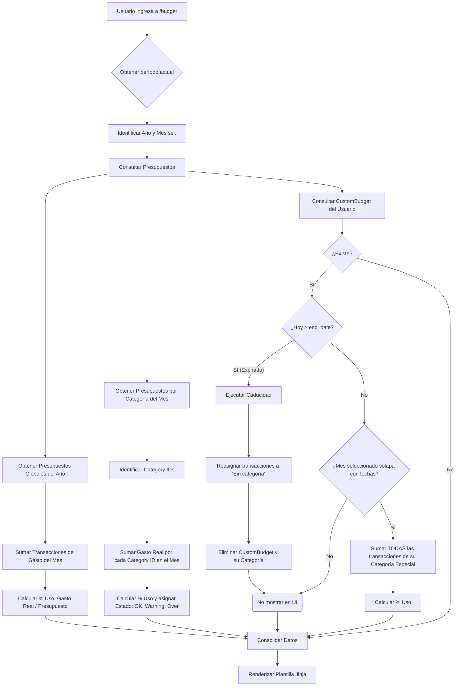

# Algoritmo y Lógica: Sección de Presupuestos

El módulo de presupuestos en Monetra está diseñado para permitir tres niveles distintos de control de gastos: **Mensual Global**, **Mensual por Categoría**, y **Personalizado (Rango Libre)**.

A continuación se detalla cómo el sistema evalúa y procesa la información para renderizar el estado del presupuesto y calcular el progreso.

## 1. Tipos de Presupuesto (Modelos de Datos)

*   `Budget`: Presupuesto global mensual. Define el techo máximo de gastos totales para un mes y año específico (`year`, `month`, `amount`).
*   `CategoryBudget`: Presupuesto mensual por categoría. Limita el gasto para una categoría específica en un mes determinado. Permite un máximo de 5 por mes.
*   `CustomBudget`: Un único presupuesto especial por usuario. Opera en un rango de fechas arbitrario (`start_date`, `end_date`) y crea automáticamente una "Categoría" especial. Todos los gastos registrados bajo esta categoría consumen el presupuesto.

---

## 2. Diagrama de Flujo (Lógica Principal)

---

## 3. Desglose Algorítmico

### Algoritmo A: Carga de Vista Mensual y Cálculo de Desempeño
1. **Inicialización**: Recupera `year` y `month` del contexto del usuario.
2. **Carga de Modelos**:
   * Hace un *Query* de `Budget` filtrando por `user_id` y `year`.
   * Hace un *Query* de `CategoryBudget` filtrando por `user_id`, `year` y `month`.
3. **Cálculo de Consumo de Categorías (`get_category_actuals`)**:
   * **Entrada:** `user_id`, `year`, `month`, lista de `category_ids` que tienen presupuesto.
   * **SQL Group By:** Ejecuta una consulta SQL sumando (`func.sum`) los montos de transacciones (`amount`) donde `type == 'expense'` y la categoría está dentro de la lista ingresada.
   * **Evaluación de Estado:** Por cada categoría, se calcula la fórmula: `(actual_amt / budget_amt) * 100`.
     * Si `>= 100`: Estado `over` (peligro / rojo).
     * Si `>= 80`: Estado `warning` (precaución / amarillo).
     * Si `< 80`: Estado `ok` (bien / verde).
4. **Ciclo de Vida del Presupuesto Personalizado (`_custom_budget_for_period`)**:
   * Si existe un `CustomBudget` para el usuario:
     * Compara la fecha actual del servidor (`today`) contra el `end_date`.
     * **Proceso de Expiración (Cascade Delete)**: Si la fecha expiró, el algoritmo toma todas las transacciones y transacciones recurrentes enlazadas a esa categoría especial, cambia su `category_id` a un valor por defecto ("Sin categoría"), borra el presupuesto personalizado, y finalmente elimina la categoría original.
     * Si no ha expirado, evalúa si el inicio del mes seleccionado cae dentro de los meses que dura el presupuesto para decidir si mostrarlo o no en la interfaz actual.
5. **Cálculo de Consumo Personalizado (`get_custom_budget_actual`)**:
   * A diferencia del presupuesto por categoría que filtra por mes, aquí la consulta suma **todas** las transacciones enlazadas a esa categoría sin importar el año o mes, ya que la categoría existe única y exclusivamente para ese rango de fechas.

### Algoritmo B: Guardado / Creación de Presupuesto
1. **Recepción POST**: Se recibe formulario (Global, Categoría o Custom).
2. **Validación Antiduplicados**:
   * En Global: Revisa que no exista ya un `Budget` para ese `month/year`.
   * En Categorías: Revisa si el límite de 5 presupuestos por mes se superó. Si es una categoría ya presupuestada, actualiza el monto; si no, la agrega.
   * En Custom: Si se crea uno nuevo, el sistema crea en *background* una nueva `Category` tipo *expense* usando el nombre del presupuesto. Luego enlaza el `category_id` al nuevo `CustomBudget`.
3. **Commit a BD** y refresco de vista.
