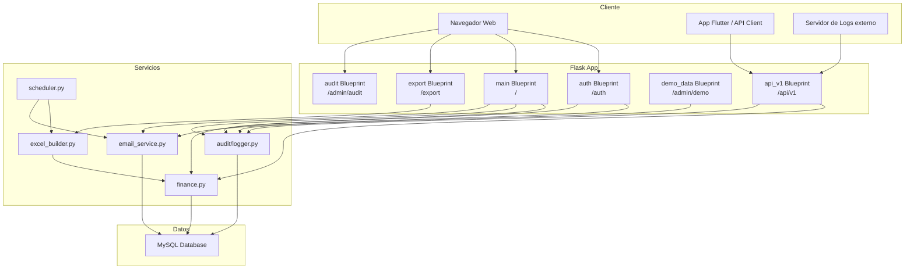

# Monetra — Documentación de Funcionamiento

> Versión actual: **2.6**

## 1. Visión General

**Monetra** es una aplicación web de finanzas personales construida con **Flask** (Python), base de datos **MySQL** y soporte para **Docker**. Permite a los usuarios registrar ingresos/gastos, definir presupuestos (global, por categoría y personalizado), crear metas de ahorro, configurar transacciones recurrentes y exportar reportes Excel mensuales o anuales.

### Stack Tecnológico

| Componente | Tecnología |
|---|---|
| Backend | Flask, SQLAlchemy, Flask-Login, Flask-WTF, Flask-Babel |
| Base de datos | MySQL (pymysql) |
| Autenticación web | Session-based (Flask-Login) |
| Autenticación API | JWT (Flask-JWT-Extended) |
| Internacionalización | Flask-Babel (es/en) |
| Seguridad | CSRF, Rate Limiting, MFA (TOTP), Fernet encryption |
| Exportación | xlsxwriter (Excel mensual y anual) |
| Scheduler | APScheduler (reporte semanal automático) |
| Auditoría | Módulo propio `audit` — registro de eventos de seguridad |
| Despliegue | Docker, entrypoint.sh |

---

## 2. Modelos de Datos

| Modelo | Propósito |
|---|---|
| `User` | Usuarios con roles (admin/user), configuración regional, tema, MFA |
| `UserYear` | Años habilitados por usuario (controla el selector de período) |
| `Category` | Categorías globales (`user_id=NULL`) o personalizadas del usuario |
| `Transaction` | Movimientos de ingreso/gasto con fecha, categoría, monto. `is_demo` para datos de ejemplo |
| `Budget` | Presupuesto mensual global (uno por mes/año/usuario) |
| `CategoryBudget` | Presupuesto mensual por categoría específica (máx. 5 por mes) |
| `CustomBudget` | Presupuesto personalizado con rango de fechas libre dentro de un mes |
| `RecurringTransaction` | Transacciones recurrentes mensuales automáticas. `is_demo` para datos de ejemplo |
| `SavingsGoal` | Metas de ahorro con progreso y fecha objetivo. `is_demo` para datos de ejemplo |
| `AppConfig` | Config global: permitir/bloquear registro de nuevos usuarios |
| `UserEmailConfig` | Configuración SMTP por usuario (contraseña cifrada con Fernet) |
| `PasswordResetToken` | Tokens de recuperación de contraseña (SHA-256, expiran en 30 min) |
| `UserSeenAnnouncement` | Control de anuncios de versión vistos por usuario |
| `DemoState` | Registra qué años creó el demo para restaurar estado al resetear |
| `AuditLog` | Registro de eventos de seguridad y actividad de la app (admin) |
| `UserPinDevice` | Dispositivos autorizados para login con PIN (token sha256, expira 90 días) |
| `UserAIConfig` | Configuración del proveedor IA para el escáner (clave de API cifrada con Fernet) |
| `EmailActivationToken` | Tokens de activación de cuenta por email (expiran en 24 h) |
| `UsdCategory` | Categorías propias de la cuenta en dólares (separadas de las principales) |
| `UsdTransaction` | Transacciones de la cuenta USD (monto en dólares, fecha, categoría USD) |
| `UsdBudget` | Presupuesto mensual para la cuenta USD |
| `ApiToken` | Tokens persistentes de 365 días para la API REST (formato `mntr_*`) |

---

## 3. Secciones y Acciones del Usuario

---

### 3.1 Autenticación (`/auth`)

#### ✅ Acciones Permitidas

| Acción | Ruta | Método | Detalles |
|---|---|---|---|
| Registrarse | `/register` | GET/POST | Crea cuenta. El primer usuario es admin automáticamente |
| Iniciar sesión | `/login` | GET/POST | Email + contraseña. Redirige a MFA si está habilitado |
| Verificar MFA | `/mfa-verify` | GET/POST | Código TOTP de 6 dígitos |
| Cerrar sesión | `/logout` | GET | Cierra sesión y redirige al login |
| Solicitar recuperación | `/forgot-password` | GET/POST | Envía enlace por email si hay SMTP configurado |
| Restablecer contraseña | `/reset-password/<token>` | GET/POST | Token válido por 30 minutos |

#### 🚫 Restricciones

- **Registro bloqueado**: Si el admin desactiva `allow_registration`, no se puede registrar.
- **Rate limiting**: Máx. 5 intentos/minuto en login y registro; 3 cada 15 min en forgot-password.
- **Contraseña débil**: Mínimo 10 caracteres, requiere mayúscula, minúscula, número y carácter especial.
- **Username/email duplicado**: No se permite registrar con datos ya existentes.
- **Usuario autenticado**: Si ya está logueado, se redirige al dashboard.
- **Token expirado/usado**: No se puede restablecer contraseña con token ya usado o expirado.
- **MFA sin sesión pendiente**: No se puede acceder a `/mfa-verify` sin pasar por login primero.
- **Recuperación sin SMTP**: El mensaje de respuesta es siempre genérico (seguridad anti-enumeración).

> **Auditoría**: Todos los eventos de auth se registran automáticamente en `AuditLog` (login_success, login_fail, logout, register, password_reset_done).

---

### 3.2 Gestión de Período

#### ✅ Acciones Permitidas

| Acción | Ruta | Método | Detalles |
|---|---|---|---|
| Cambiar mes/año | `/set-period` | POST | Cambia el período seleccionado en la sesión |
| Crear año nuevo | `/create-year` | POST | Añade un año al selector (2020–2100) |
| Eliminar año | `/delete-year` | POST | Elimina año + todos sus movimientos y presupuestos |

#### 🚫 Restricciones

- **Rango de años**: Solo se permiten años entre 2020 y 2100.
- **Año duplicado**: No se crea si ya existe para el usuario.
- **Eliminar año actual**: Al eliminar el año seleccionado, se resetea al año de hoy.
- **Mes inválido**: Solo se aceptan valores 1–12.
- **Años demo**: Los años generados por el demo no pueden eliminarse mientras el demo esté activo.

---

### 3.3 Dashboard Mensual (`/dashboard`)

#### ✅ Acciones Permitidas

| Acción | Detalles |
|---|---|
| Ver resumen mensual | Total ingresos, gastos, balance, uso del presupuesto |
| Ver gráfico de gastos por categoría | Chart.js (donut) con colores por categoría |
| Ver últimos 5 movimientos | Lista ordenada por fecha desc |
| Ver metas de ahorro activas | Hasta 4 metas activas con barra de progreso |
| Ver presupuestos por categoría | Con estado visual (ok / warning / over) |
| Ver presupuesto personalizado | Si existe para el período seleccionado |

#### 🚫 Restricciones

- **Solo lectura**: No se pueden crear/editar datos directamente desde el dashboard.
- **Requiere login**: `@login_required` en todas las rutas.
- **Generación automática de recurrentes**: Se ejecuta silenciosamente al cargar el dashboard.
- **Año demo**: Si el año seleccionado es un año demo, se muestra un banner de solo lectura.

---

### 3.4 Dashboard Global (`/dashboard/global`)

#### ✅ Acciones Permitidas

| Acción | Detalles |
|---|---|
| Ver tendencia mensual de ingresos/gastos | Gráfico de línea del año seleccionado |
| Ver gastos por categoría (anual) | Gráfico de barras |
| Ver resumen anual comparativo | Tabla con totales por año |
| Ver tendencia multi-año de gastos | Gráfico de líneas superpuestas por año |
| Filtrar por rango de meses | `from_month` / `to_month` (query params) |
| Cambiar año visualizado | Parámetro `year` |

#### 🚫 Restricciones

- **Solo lectura**: No se modifican datos.
- **Rango de meses**: `from_month` ajustado a 1–12; `to_month` ≥ `from_month`.

---

### 3.5 Transacciones (`/transactions`)

#### ✅ Acciones Permitidas

| Acción | Ruta | Método | Detalles |
|---|---|---|---|
| Listar movimientos | `/transactions` | GET | Filtros: tipo, categoría, día |
| Crear movimiento | `/transactions/new` | GET/POST | Ingreso o gasto con categoría, monto, fecha, descripción |
| Editar movimiento | `/transactions/<id>/edit` | GET/POST | Modifica todos los campos |
| Eliminar movimiento | `/transactions/<id>/delete` | POST | Eliminación directa |

#### 🚫 Restricciones

- **Fecha fuera de mes**: La fecha debe estar dentro del mes/año seleccionado.
- **Categoría inválida**: Debe pertenecer al usuario o ser global, y coincidir con el tipo (income/expense).
- **Monto ≤ 0**: Mínimo 0.01.
- **Descripción**: Máximo 200 caracteres, opcional.
- **Movimiento ajeno**: Solo se pueden editar/eliminar movimientos del usuario actual.
- **Transacciones demo** (`is_demo=True`): No se pueden editar ni eliminar. Se muestra badge de solo lectura.
- **Crear en año demo**: No se pueden agregar transacciones en un año demo.

---

### 3.6 Categorías (`/categories`)

#### ✅ Acciones Permitidas

| Acción | Ruta | Método | Detalles |
|---|---|---|---|
| Ver categorías | `/categories` | GET | Separadas en globales y personalizadas, por tipo |
| Crear categoría | `/categories` | POST | Nombre + tipo (ingreso/gasto). Color asignado automáticamente |
| Eliminar categoría | `/categories/<id>/delete` | POST | Solo categorías propias del usuario |

#### 🚫 Restricciones

- **Nombre duplicado**: No se puede crear si ya existe con mismo nombre y tipo.
- **Eliminar categoría global**: No se puede. Solo las del usuario (`user_id = current_user.id`).
- **Categoría con datos asociados**: Si tiene transacciones, recurrentes o presupuestos de categoría, NO se elimina. Se muestra modal de bloqueo.
- **Categoría de presupuesto personalizado**: No se puede eliminar desde aquí; debe eliminarse desde presupuestos.
- **Nombre máximo**: 50 caracteres.

---

### 3.7 Presupuestos (`/budget`)

#### 3.7.1 Presupuesto Mensual Global

| Acción | Ruta | Método | Detalles |
|---|---|---|---|
| Crear/actualizar presupuesto | `/budget` | POST | Un presupuesto por mes/año/usuario |
| Eliminar presupuesto | `/budget/<id>/delete` | POST | Solo del período actual |

#### 3.7.2 Presupuestos por Categoría

| Acción | Ruta | Método | Detalles |
|---|---|---|---|
| Crear ppto. de categoría | `/budget/categoria/guardar` | POST | Solo categorías de gasto |
| Editar ppto. de categoría | `/budget?edit_cb=<id>` | GET → POST | Modifica monto |
| Eliminar ppto. de categoría | `/budget/categoria/<id>/delete` | POST | Eliminación directa |

#### 3.7.3 Presupuesto Personalizado (Custom Budget)

| Acción | Ruta | Método | Detalles |
|---|---|---|---|
| Crear ppto. personalizado | `/budget/personalizado/guardar` | POST | Crea una categoría de gasto asociada automáticamente |
| Editar ppto. personalizado | `/budget?edit_custom=1` → POST | Modifica nombre, monto, fechas |
| Eliminar ppto. personalizado | `/budget/personalizado/<id>/delete` | POST | Elimina categoría asociada si no tiene datos |

#### 🚫 Restricciones — Presupuestos

- **Máximo 5 pptos. de categoría** por mes/período.
- **Solo categorías de gasto** para pptos. de categoría.
- **Categoría ya usada**: No se puede crear otro ppto. para una categoría que ya tiene uno en el período.
- **Un ppto. personalizado por mes**: No se permite más de uno por período.
- **Fechas del ppto. personalizado**: Inicio y fin deben estar dentro del mismo mes seleccionado.
- **Fecha inicio < hoy**: No permitido al crear (al editar se permite mantener la fecha original).
- **Nombre conflictivo**: El nombre del ppto. personalizado no puede coincidir con una categoría existente.
- **Eliminar ppto. personalizado con datos**: Si la categoría tiene transacciones o recurrentes, no se elimina.
- **Monto ≤ 0**: No se acepta (mínimo 0.01).
- **Año demo**: No se pueden crear, editar ni eliminar presupuestos en un año demo.

---

### 3.8 Metas de Ahorro (`/metas`)

#### ✅ Acciones Permitidas

| Acción | Ruta | Método | Detalles |
|---|---|---|---|
| Ver metas | `/metas` | GET | Activas y completadas con gráfico de progreso |
| Crear meta | `/metas/nueva` | GET/POST | Nombre, monto objetivo, monto inicial, fecha, descripción |
| Editar meta | `/metas/<id>/editar` | GET/POST | Modifica todos los campos |
| Eliminar meta | `/metas/<id>/eliminar` | POST | Eliminación directa |
| Abonar a meta | `/metas/<id>/abonar` | POST (JSON) | Incrementa monto actual. Auto-completa si alcanza objetivo |
| Marcar completa/incompleta | `/metas/<id>/completar` | POST | Toggle del estado `is_completed` |

#### 🚫 Restricciones

- **Monto objetivo ≤ 0**: No se acepta.
- **Abono ≤ 0**: No se acepta.
- **Nombre**: Máximo 100 caracteres, requerido.
- **Descripción**: Máximo 200 caracteres, opcional.
- **Meta ajena**: Solo se pueden operar metas del usuario actual.
- **Auto-completar**: Si `current_amount ≥ target_amount`, la meta se marca completada automáticamente.
- **Metas demo** (`is_demo=True`): No se pueden editar, eliminar ni abonar. Se muestra badge de solo lectura.

---

### 3.9 Transacciones Recurrentes (`/recurrentes`)

#### ✅ Acciones Permitidas

| Acción | Ruta | Método | Detalles |
|---|---|---|---|
| Ver recurrentes | `/recurrentes` | GET | Vigentes y finalizadas, con gráfico de distribución |
| Crear recurrente | `/recurrentes/nueva` | GET/POST | Tipo, monto, categoría, día del mes, fecha término |
| Editar recurrente | `/recurrentes/<id>/editar` | GET/POST | Modifica todos los campos |
| Eliminar recurrente | `/recurrentes/<id>/eliminar` | POST | No borra las transacciones ya generadas |

#### 🚫 Restricciones

- **Día del mes**: Solo 1–28 (evita problemas con meses cortos).
- **Categoría/tipo**: La categoría debe coincidir con el tipo seleccionado.
- **Fecha de término**: Debe estar dentro del año de creación de la recurrente.
- **Generación automática**: Al visitar dashboard o transacciones, se materializan las transacciones pendientes.
- **Backfill al reactivar**: Al reactivar una recurrente inactiva se generan retroactivamente las transacciones faltantes del año.
- **Recurrentes demo** (`is_demo=True`): No se pueden editar ni eliminar. Se muestran como solo lectura con badge.

---

### 3.10 Configuración (`/configurar`)

#### ✅ Acciones Permitidas

| Acción | Ruta | Método | Detalles |
|---|---|---|---|
| Config. regional | `/configurar` | POST | País, símbolo de moneda (22 países soportados) |
| Cambiar tema | `/configurar/theme` | POST | 8 temas: dark, ocean, carbon, dusk, forest, pearl, abyss, graphite |
| Cambiar contraseña | `/configurar/change-password` | POST | Requiere contraseña actual + política de seguridad |
| Configurar SMTP | `/configurar` (submit_smtp) | POST | Host, puerto, usuario, contraseña, TLS/SSL |
| Enviar correo de prueba | `/configurar/test-email` | POST | Usa SMTP del usuario |
| Activar MFA | `/configurar/mfa-setup` + `/mfa-confirm` | POST | Genera QR, confirma con código TOTP |
| Desactivar MFA | `/configurar/mfa-disable` | POST | Requiere código TOTP válido |
| Toggle reporte semanal | `/configurar/weekly-report` | POST | Activa/desactiva envío automático los lunes |
| Enviar reporte ahora | `/configurar/send-report-now` | POST | Genera y envía Excel por email inmediatamente |
| Toggle modo ayuda | `/configurar/help-toggle` | POST | Activa/desactiva tooltips de ayuda |
| Generar token API | `/configurar/generate-api-token` | POST | Token persistente válido 365 días (formato `mntr_*`) |
| Descartar onboarding | `/onboarding/dismiss` | POST | Marca como visto |
| Cambiar idioma | `/set-language/<lang>` | GET | 'es' o 'en' |
| Configurar Escáner IA | `/configurar` (submit_ai) | POST | Proveedor, modelo, URL base y API key cifrada |
| Activar PIN | `/pin/set` | POST | Activa el PIN de acceso rápido; requiere contraseña actual |
| Eliminar PIN | `/pin/delete` | POST | Revoca el PIN y todos los dispositivos autorizados; requiere contraseña |
| Login con PIN | `/pin/login` | POST | Inicio de sesión con PIN desde dispositivo autorizado (solo móvil) |
| Toggle panel de analítica | `/configurar` (insights toggle) | POST | Activa/desactiva el panel de salud financiera y alertas |
| Config. admin (registro) | `/configurar` (submit_admin) | POST | Solo para `is_first_admin` |
| Datos Demo | `/admin/demo/*` | GET/POST | Solo para usuarios con `role = admin` |
| Registro de Auditoría | `/admin/audit/` | GET | Solo para usuarios con `role = admin` (abre en nueva pestaña) |

#### 🚫 Restricciones

- **Cambiar contraseña**: Cierra sesión obligatoriamente. Aplica misma política que registro.
- **SMTP TLS + SSL**: No se pueden activar ambos simultáneamente.
- **SMTP campos requeridos**: Si SMTP está activado, host, puerto y username son obligatorios.
- **Config. admin**: Solo accesible por `is_admin AND is_first_admin`. Si otro usuario intenta → 403.
- **Tema inválido**: Se resetea a 'dark'.
- **Desactivar MFA**: Requiere código TOTP válido.
- **Escáner IA**: Sin `UserAIConfig` configurado, el botón de cámara no aparece en la UI.
- **PIN de acceso rápido**: Solo aparece en móvil (pantalla < 992 px). El dispositivo debe haber sido autorizado desde Configuración y la cookie `monetra_pin_device` debe estar presente.
- **Sección Demo**: Solo visible y operable por usuarios con `role = admin`.
- **Sección Auditoría**: Solo visible y operable por usuarios con `role = admin`.

---

### 3.11 Datos Demo (`/admin/demo`) — Solo Admin

Genera datos ficticios de ejemplo para explorar todos los paneles sin ingresar datos reales. **Restringido exclusivamente a usuarios con rol admin.**

#### ✅ Acciones Permitidas

| Acción | Ruta | Método | Detalles |
|---|---|---|---|
| Ver estado demo | `/admin/demo/status` | GET | JSON con resumen de datos demo cargados |
| Cargar datos demo | `/admin/demo/load` | POST | Genera 3 años completos de datos ficticios |
| Eliminar datos demo | `/admin/demo/reset` | POST | Elimina todos los datos demo y restaura el estado previo |

**Datos generados al cargar (3 años: año-3 al año-1 del actual):**

| Tipo | Cantidad aprox. | Detalles |
|---|---|---|
| Transacciones ingreso | 36 | 1 sueldo/mes por 12 meses × 3 años |
| Transacciones gasto | ~400–650 | 10–18 gastos/mes por año, categorías variadas |
| Presupuesto mensual | 36 | Ligeramente superior al gasto generado |
| Presupuesto por categoría | 108 | 3 categorías × 12 meses × 3 años |
| Transacciones recurrentes | 6 | Inactivas, solo de muestra (2 ingresos + 4 gastos) |
| Metas de ahorro | 5 | Variedad: completada, en progreso, vencida, sin fecha |

**Protección de solo lectura:** Todos los registros demo tienen `is_demo=True`. Los años demo tienen `is_demo_year=True` en el contexto. Ningún dato demo puede editarse ni eliminarse.

#### 🚫 Restricciones

- **Solo admin**: No admin → HTTP 403 JSON.
- **Demo ya cargado**: No se puede cargar dos veces (debe resetear primero).
- **Categorías requeridas**: Necesita al menos una categoría de gasto disponible.
- **Solo lectura**: Los registros y años demo no son editables por ningún usuario.
- **Banner de aviso**: Cuando el año seleccionado es demo, se muestra un banner amber en toda la UI.
- **Audit log**: Las operaciones de carga y reset se registran en `AuditLog` (`admin.demo_load`, `admin.demo_reset`).

---

### 3.12 Exportación Excel (`/export/excel`)

#### ✅ Acciones Permitidas

| Acción | Ruta | Método | Detalles |
|---|---|---|---|
| Descargar Excel mensual | `/export/excel?year=Y&from_month=M&to_month=M` | GET | Exporta un mes específico |
| Descargar Excel anual | `/export/excel?year=Y` | GET | Exporta el año completo (from_month=1, to_month=12) |
| Descargar Excel por rango | `/export/excel?year=Y&from_month=M1&to_month=M2` | GET | Exporta un rango de meses |

**Nombre del archivo generado:**

| Escenario | Nombre |
|---|---|
| Mes único | `monetra_{username}_{year}_{month:02d}.xlsx` |
| Año completo o rango | `monetra_{username}_{year}.xlsx` |

**Hojas incluidas**: Dashboard, Movimientos, Categorías, Presupuestos, Metas, Recurrentes, Base de Datos (raw).

#### 🚫 Restricciones

- **Año**: 2000–2100, si inválido se usa el año actual.
- **Meses**: `from_month` 1–12; `to_month` ≥ `from_month`.
- **Requiere login**: Solo datos del usuario autenticado.

---

### 3.13 Registro de Auditoría (`/admin/audit`) — Solo Admin

Panel de visualización de eventos de seguridad y actividad de la aplicación. Se accede desde Configuración → Opciones de Administrador → "Registro de Auditoría" (abre en nueva pestaña).

#### ✅ Acciones Permitidas

| Acción | Ruta | Método | Detalles |
|---|---|---|---|
| Ver eventos | `/admin/audit/` | GET | Panel con KPIs, gráfico donut y tabla paginada |

**Filtros disponibles en UI:**

| Filtro | Descripción |
|---|---|
| Categoría | `auth`, `app`, `config`, `admin` |
| IP | Substring sobre ip_address |
| User ID | Filtro exacto por ID numérico |
| Página | Paginación de 50 eventos por página |

**KPIs del panel:**

- Total de eventos registrados
- Eventos de categoría `auth`
- IPs únicas (últimos 7 días)
- Usuarios activos únicos (últimos 7 días)

**Tipos de eventos registrados:**

| Categoría | Eventos |
|---|---|
| `auth` | login_success, login_fail, logout, register, password_change, mfa_enabled, mfa_disabled, password_reset_req, password_reset_done |
| `app` | error_500, rate_limited |
| `config` | settings, smtp, registration |
| `admin` | demo_load, demo_reset |

#### 🚫 Restricciones

- **Solo admin**: No admin → HTTP 403.
- **Solo lectura**: No se pueden eliminar ni modificar registros de auditoría desde la UI.

---

### 3.14 API REST (`/api/v1`)

Autenticación por **JWT** (Bearer token). CSRF está exento para la API.

#### Autenticación API

| Endpoint | Método | Detalles |
|---|---|---|
| `/api/v1/login` | POST | Email + password → access_token + refresh_token |
| `/api/v1/refresh` | POST | Refresh token → nuevo access_token |
| `/api/v1/logout` | POST | No-op (cliente descarta token) |
| `/api/v1/me` | GET | Datos del usuario autenticado |

#### Transacciones API

| Endpoint | Método | Detalles |
|---|---|---|
| `/api/v1/transactions` | GET | Filtros: year, month, type, category_id |
| `/api/v1/transactions` | POST | Crear transacción (JSON) |
| `/api/v1/transactions/<id>` | PUT | Actualizar campos |
| `/api/v1/transactions/<id>` | DELETE | Eliminar transacción |

#### Presupuestos API

| Endpoint | Método | Detalles |
|---|---|---|
| `/api/v1/budgets` | GET | Filtro: year |
| `/api/v1/budgets` | POST | Upsert: crear o actualizar |
| `/api/v1/budgets/<id>` | PUT | Actualizar monto |

#### Categorías API

| Endpoint | Método | Detalles |
|---|---|---|
| `/api/v1/categories` | GET | Filtro: type (income/expense). Solo lectura |

#### Recurrentes API

| Endpoint | Método | Detalles |
|---|---|---|
| `/api/v1/recurring` | GET | Filtros: type, active_only |
| `/api/v1/recurring` | POST | Crear recurrente |
| `/api/v1/recurring/<id>` | PUT | Actualizar parcial |
| `/api/v1/recurring/<id>` | DELETE | Eliminar |

#### Metas de Ahorro API

| Endpoint | Método | Detalles |
|---|---|---|
| `/api/v1/savings` | GET | Filtro: completed (true/false/all) |
| `/api/v1/savings` | POST | Crear meta |
| `/api/v1/savings/<id>` | PUT | Actualizar parcial |
| `/api/v1/savings/<id>` | DELETE | Eliminar |
| `/api/v1/savings/<id>/contribute` | POST | Abonar monto |

#### Dashboard API

| Endpoint | Método | Detalles |
|---|---|---|
| `/api/v1/dashboard/summary` | GET | Resumen mensual (year, month) |
| `/api/v1/dashboard/global` | GET | Resumen global (year, from_month, to_month) |

#### Auditoría API — Solo Admin

| Endpoint | Método | Detalles |
|---|---|---|
| `/api/v1/audit/logs` | GET | Lista paginada de eventos de auditoría |

**Query params de `/api/v1/audit/logs`:**

| Param | Tipo | Descripción |
|---|---|---|
| `category` | string | Prefijo: `auth`, `app`, `config`, `admin` |
| `event_type` | string | Tipo exacto, ej. `auth.login_fail` |
| `user_id` | int | Filtro por ID de usuario |
| `ip` | string | Substring de ip_address |
| `since` | ISO 8601 | Solo eventos con `created_at > since` |
| `until` | ISO 8601 | Solo eventos con `created_at <= until` |
| `page` | int | Página (default: 1) |
| `per_page` | int | Filas por página (default: 50, máx: 100) |

**Uso para polling incremental (servidor de logs externo):**
```
GET /api/v1/audit/logs?since=2026-05-04T10:00:00Z&per_page=100
```
El cliente guarda el `created_at` del último evento y lo usa como `since` en el siguiente ciclo.

#### 🚫 Restricciones API

- **Token inválido/expirado**: HTTP 401.
- **Rate limiting**: 5/min en login.
- **Datos ajenos**: Solo se accede a datos del usuario del token.
- **day_of_month en recurrentes**: 1–28.
- **Abonar a meta completada**: HTTP 400.
- **Presupuestos de categoría/personalizados**: No disponibles en API.
- **Auditoría API**: Solo accesible con token de usuario `admin` → 403 para usuarios normales.
- **`since`/`until` inválido**: HTTP 400 con mensaje descriptivo.

---

### 3.15 Sistema de Anuncios

#### ✅ Acciones Permitidas

| Acción | Ruta | Método | Detalles |
|---|---|---|---|
| Marcar anuncio como visto | `/announcements/<key>/seen` | POST | Registra que el usuario vio el anuncio de versión |

#### 🚫 Restricciones

- **Usuarios nuevos**: Si la cuenta fue creada después de `released_at`, el anuncio no se muestra.
- **Solo el anuncio actual**: Solo se puede marcar como visto el `CURRENT_ANNOUNCEMENT` (v2.0).

---

### 3.16 Cuenta en dólares (USD) (`/usd`)

Permite registrar ingresos y gastos en USD de forma separada y consultar una vista consolidada que convierte los montos USD a la moneda local del usuario usando el valor de referencia configurado.

#### ✅ Acciones Permitidas

| Acción | Ruta | Método | Detalles |
|---|---|---|---|
| Ver dashboard USD | `/usd/` | GET | Resumen mensual en dólares, gráfico y listado de movimientos |
| Crear transacción USD | `/usd/transaction/new` | POST | Tipo, monto USD, categoría USD, fecha, descripción |
| Editar transacción USD | `/usd/transaction/<id>/edit` | POST | Modifica todos los campos |
| Eliminar transacción USD | `/usd/transaction/<id>/delete` | POST | Eliminación directa |
| Crear categoría USD | `/usd/category/new` | POST | Nombre + tipo. Separadas de las categorías principales |
| Eliminar categoría USD | `/usd/category/<id>/delete` | POST | Solo propias, sin datos asociados |
| Definir presupuesto USD | `/usd/budget/set` | POST | Un presupuesto mensual en USD por período |
| Ver vista consolidada | `/analytics/consolidated` | GET | Movimientos locales + USD convertidos a moneda local |

#### 🚫 Restricciones

- **Valor de referencia**: Si no se define el tipo de cambio en Configuración, la vista consolidada no puede calcular el equivalente en moneda local.
- **Categorías separadas**: Las categorías USD (`UsdCategory`) son independientes de las categorías principales; no se comparten.
- **Un presupuesto USD por mes**: No se puede crear más de uno por período.

---

### 3.17 Escáner IA de Recibos (`/scanner`)

Permite fotografiar un ticket o recibo y extraer automáticamente el monto, la categoría sugerida y la fecha para crear una transacción sin ingresar datos manualmente.

#### ✅ Acciones Permitidas

| Acción | Ruta | Método | Detalles |
|---|---|---|---|
| Probar conexión con proveedor IA | `/scanner/test` | POST | Verifica que la API key y modelo están configurados correctamente |
| Extraer datos del recibo | `/scanner/extract` | POST | Recibe imagen (JPEG/PNG/HEIC/WEBP), devuelve JSON con monto, categoría y fecha |

**Proveedores IA soportados** (`scanner/providers.py`):

| Proveedor | Compatibilidad |
|---|---|
| OpenAI | GPT-4o y modelos con visión |
| DeepSeek | API compatible con OpenAI |
| OpenRouter | Proxy multi-modelo compatible con OpenAI |
| Anthropic | Claude 3+ con visión |
| Gemini | Gemini 1.5+ |
| Ollama | Modelos locales con soporte de visión |

#### 🚫 Restricciones

- **Requiere `UserAIConfig`**: Sin proveedor + modelo + API key configurados en Configuración, el endpoint devuelve error.
- **Formatos de imagen**: JPEG, PNG, WEBP y HEIC (pillow-heif). Se valida y normaliza antes de enviar al proveedor.
- **Datos biométricos**: La imagen se procesa en memoria y se descarta; no se almacena en la BD.
- **API key cifrada**: La clave del proveedor se almacena cifrada con Fernet en `UserAIConfig`; nunca en texto plano.

---

### 3.18 PIN de acceso rápido

Login opt-in vinculado al dispositivo. Solo se activa desde Configuración y solo aparece en la pantalla de login en móvil (pantalla < 992 px). No es portátil: si se borran las cookies o se cambia de dispositivo hay que reactivarlo desde Configuración.

#### ✅ Acciones Permitidas

| Acción | Ruta | Detalles |
|---|---|---|
| Activar PIN | `/pin/set` | El usuario elige un PIN de 8 dígitos; se guarda hash en `User`; se crea `UserPinDevice` con token sha256 en cookie httpOnly |
| Login con PIN | `/pin/login` | Cookie `monetra_pin_device` identifica el dispositivo; se verifica PIN + token; si hay 2FA activo redirige a TOTP |
| Eliminar PIN | `/pin/delete` | Revoca el PIN y todos los `UserPinDevice` del usuario; requiere contraseña actual |

#### 🚫 Restricciones

- **Solo móvil**: El campo de PIN solo se muestra en pantallas < 992 px (gate client-side).
- **No portátil**: La autorización es por dispositivo (cookie httpOnly `monetra_pin_device`). Si se borra la cookie o se cambia de navegador, hay que reactivar desde Configuración.
- **Expiración**: La autorización del dispositivo caduca a los 90 días de inactividad.
- **Bloqueo**: 5 intentos fallidos bloquean el PIN durante 15 minutos (`MAX_FAILS=5 / LOCK_MINUTES=15`).
- **No reemplaza la contraseña**: La contraseña es necesaria para activar y eliminar el PIN.

---

### 3.19 Panel de Analítica (`/analytics`)

Dashboard de análisis financiero inteligente con salud financiera, proyección del mes y alertas. Es opcional y se activa desde Configuración de Cuenta.

#### ✅ Acciones Permitidas

| Acción | Ruta | Método | Detalles |
|---|---|---|---|
| Ver panel de analítica | `/analytics/dashboard` | GET | Salud financiera, proyección de cierre, alertas del mes actual |
| Ver consolidado USD + local | `/analytics/consolidated` | GET | Movimientos de ambas cuentas convertidos a moneda local |

**Componentes del motor de análisis** (`insights/` + `analytics/`):

| Componente | Descripción |
|---|---|
| Scoring (`scoring.py`) | Puntuación de salud financiera (0–100) |
| Forecasting (`forecasting.py`) | Proyección de ingresos y gastos al cierre del mes |
| Rules/Signals (`rules.py`, `signals.py`) | Detección de anomalías, alertas de presupuesto, déficit, metas |
| Anomalies (`anomalies.py`) | Movimientos inusuales respecto al historial |
| Capacity (`capacity.py`) | Capacidad de ahorro estimada |
| Savings Goals (`savings_goals.py`) | Estado y proyección de metas de ahorro |

#### 🚫 Restricciones

- **Modo aprendizaje**: Para usuarios nuevos con poco historial, las alertas son más suaves y orientativas mientras el motor aprende los hábitos.
- **Panel opcional**: Si el usuario no lo activa en Configuración, no aparece en la UI principal (evita saturar la vista).
- **Solo lectura**: No se pueden crear ni modificar datos desde este panel.

---

### 3.20 Backup y Restauración de Base de Datos (Admin) (`/admin/backup`)

Permite al administrador exportar un backup cifrado de la base de datos y restaurarla desde un archivo. Diseñado para migraciones y recuperación ante desastres.

#### ✅ Acciones Permitidas

| Acción | Ruta | Método | Detalles |
|---|---|---|---|
| Exportar BD | `/admin/backup/export` | POST | Genera `.sql.gz` con `mysqldump` cifrado. Requiere contraseña de cuenta |
| Restaurar BD | `/admin/backup/restore` | POST | Sube `.sql` y ejecuta restauración. Requiere contraseña de cuenta |

**Variables que controlan los límites** (en `docker/.env`):

| Variable | Default | Descripción |
|---|---|---|
| `MAX_CONTENT_UPLOAD_MB` | 15 | Tamaño máximo del archivo `.sql` subido para restaurar |
| `MAX_RESTORE_SQL_MB` | 500 | Tamaño máximo permitido del SQL tras descomprimir |

#### 🚫 Restricciones

- **Solo admin**: No admin → HTTP 403.
- **Re-autenticación obligatoria**: Tanto el export como el restore requieren introducir la contraseña de la cuenta activa antes de ejecutarse.
- **Archivo demasiado grande**: Si el `.sql` supera `MAX_RESTORE_SQL_MB`, la restauración es rechazada.
- **mysqldump disponible**: La imagen Docker incluye `default-mysql-client`. En ejecución local sin Docker, `mysqldump` y `mysql` deben estar en el `PATH`.

---

### 3.21 Scheduler (Reporte Semanal)

- **Ejecución**: Cada lunes a las 10:00 UTC.
- **Destinatarios**: Usuarios con `weekly_report_enabled = True`.
- **Contenido**: Excel con todas las hojas, adjunto por email.
- **Fallback SMTP**: Usa SMTP del usuario → si no, SMTP del admin.
- **Concurrencia**: Máximo 5 usuarios simultáneos (ThreadPoolExecutor).

---

## 4. Seguridad — Resumen de Controles

| Control | Implementación |
|---|---|
| CSRF | Flask-WTF en todas las rutas web (exento en API) |
| Rate Limiting | Flask-Limiter por IP (en memoria, 1 worker Gunicorn) |
| Hashing contraseñas | Werkzeug (pbkdf2) |
| Encriptación SMTP/MFA/AI | Fernet (clave en `FIELD_ENCRYPTION_KEY`) — cifra contraseñas SMTP, secrets TOTP y API keys del scanner |
| MFA | TOTP (pyotp), QR code con qrcode |
| PIN de acceso rápido | Token sha256 en cookie httpOnly (`monetra_pin_device`). Bloqueo automático tras 5 intentos fallidos (15 min) |
| Aislamiento de datos | Todas las queries filtran por `user_id` |
| Tokens de reset | SHA-256 hash, expiración 30 min, single-use |
| CORS | Configurable via `CORS_ORIGINS` (solo `/api/*`) |
| JWT | Access token 15 min, Refresh token 30 días |
| Token API persistente | `ApiToken` — 365 días, formato `mntr_*`, revocable desde Configuración |
| Backup re-autenticación | Export y restore requieren contraseña de cuenta activa antes de ejecutarse |
| Auditoría | `AuditLog` registra todos los eventos críticos de seguridad |
| Datos demo | `is_demo=True` en registros — protección de solo lectura a nivel de ruta y UI |

---

## 5. Diagrama de Arquitectura



---

## 6. Resumen de Acciones Globales No Permitidas

| Restricción | Aplica a |
|---|---|
| Acceder sin login | Todas las rutas excepto auth y set-language |
| Operar datos de otro usuario | Toda la aplicación (filtro `user_id`) |
| Modificar categorías globales | Todos los usuarios |
| Eliminar categorías con datos asociados | Categorías con tx, recurrentes o pptos |
| Crear presupuesto personalizado con nombre de categoría existente | Presupuestos personalizados |
| Exceder 5 presupuestos de categoría por mes | Presupuestos por categoría |
| Registrarse si el admin lo desactivó | Registro |
| Usar contraseña débil | Registro y cambio de contraseña |
| Acceder a config admin sin ser `is_first_admin` | Configuración |
| Acceder a datos demo / auditoría sin ser admin | Demo y Auditoría |
| Cargar demo data dos veces sin resetear | Datos demo |
| Editar o eliminar registros con `is_demo=True` | Transacciones, metas, recurrentes demo |
| Crear/editar/eliminar en un año demo | Transacciones, presupuestos |
| Crear recurrente con día > 28 | Recurrentes |
| Fecha de transacción fuera del mes seleccionado | Transacciones |
| Categoría que no coincide con el tipo de movimiento | Transacciones y recurrentes |
| Usar `since`/`until` con formato inválido en API de auditoría | API /audit/logs |
| Consumir API de auditoría sin rol admin | API /audit/logs |
| Usar escáner IA sin `UserAIConfig` configurado | Scanner IA |
| Exportar/restaurar BD sin contraseña de cuenta | Backup/Restore |
| Acceder a backup/restore sin ser admin | Backup/Restore |
| Subir archivo SQL mayor a `MAX_CONTENT_UPLOAD_MB` | Restore BD |
| Usar categorías principales en la cuenta USD | Cuenta USD |
